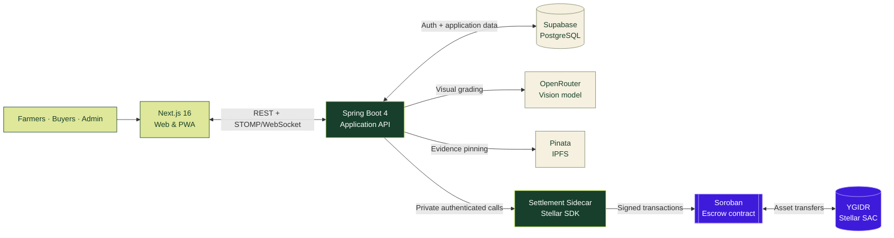
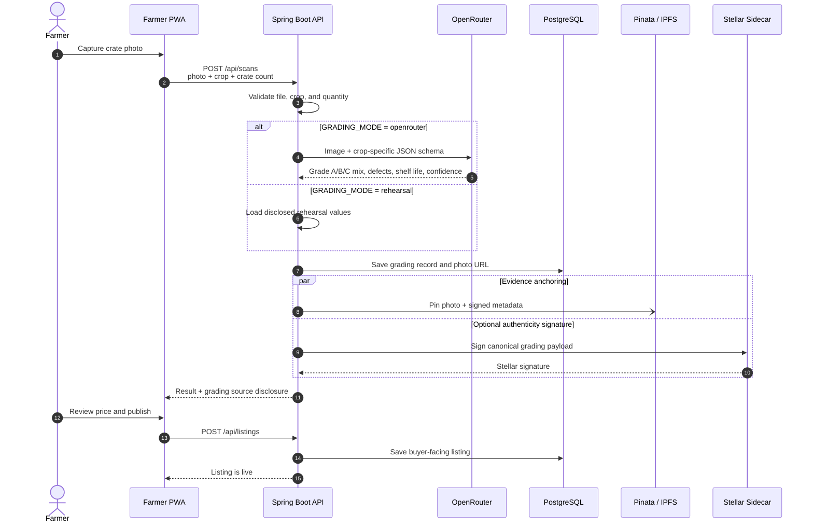
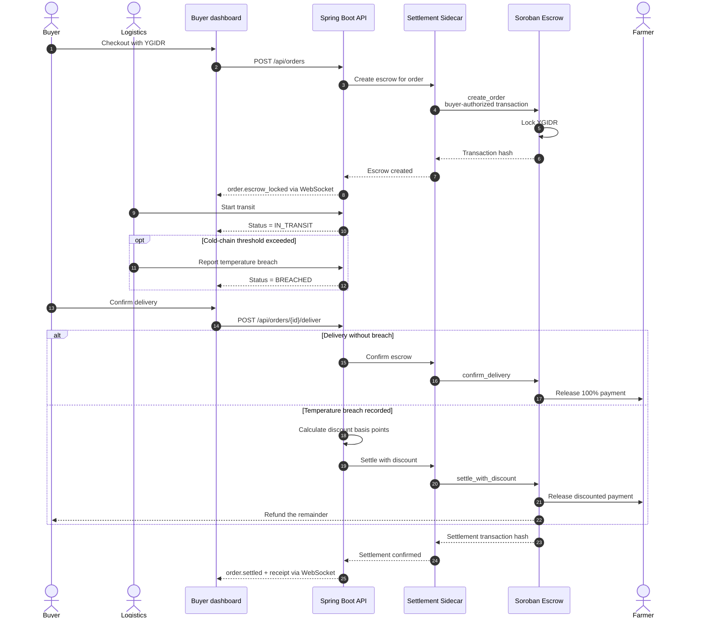

<p align="center">
  
</p>

<p align="center">
  <b>A good harvest should not lose its value between the farm and the buyer.</b>
  <br>
  <i>YieldGrid keeps quality visible, payment protected, and produce moving.</i>
</p>

YieldGrid is a direct farm-to-buyer marketplace where farmers photograph a real crate,
receive a structured visual grade, and publish it with an estimated shelf life. Buyers see the
quality mix, origin, remaining life, and direct price before ordering—not after the produce
arrives.

Payments can be protected in **YGIDR escrow on Stellar Testnet**. When delivery is verified,
the farmer is paid. If the cold chain is breached, the contract can split settlement between
the farmer and a buyer refund using a temperature-based discount.

<p align="center">
  
  
  
  
</p>

<p align="center">
  🏆 <b>Garuda Hacks 2026</b> · Agriculture · Trade Infrastructure · Stellar <b>Testnet</b>
</p>

<p align="center">
  <a href="https://yield-grid.vercel.app/">
    
  </a>
  &nbsp;
  <a href="https://github.com/BudakGPT/yield-grid">
    
  </a>
</p>

---

## Demo

> 🎬 **Follow one harvest end-to-end.** A farmer scans a crate, a buyer purchases the
> verified listing, escrow protects the payment, and delivery evidence decides settlement.

<table>
  <tr>
    <td width="50%" valign="top">
      <b>① Scan the harvest</b><br/>
      <sub>The farmer submits a tomato or banana crate photo from the field-friendly PWA.</sub>
    </td>
    <td width="50%" valign="top">
      <b>② Review the visual grade</b><br/>
      <sub>YieldGrid returns the Grade A/B/C mix, visible defects, confidence, and expected shelf life.</sub>
    </td>
  </tr>
  <tr>
    <td width="50%" valign="top">
      <b>③ Publish the listing</b><br/>
      <sub>The saved grade becomes a buyer-facing listing with farmer location, quantity, and direct price.</sub>
    </td>
    <td width="50%" valign="top">
      <b>④ Buy with protected payment</b><br/>
      <sub>A buyer checks out with YGIDR; the sidecar locks funds in the Soroban escrow contract.</sub>
    </td>
  </tr>
  <tr>
    <td width="50%" valign="top">
      <b>⑤ Track the delivery</b><br/>
      <sub>Order and temperature events stream to the interface over WebSocket.</sub>
    </td>
    <td width="50%" valign="top">
      <b>⑥ Settle fairly</b><br/>
      <sub>Verified delivery pays the farmer in full; a recorded breach applies a transparent buyer refund.</sub>
    </td>
  </tr>
</table>

## How It Works

Five connected moves carry produce from a real crate to a completed payout:

- 📷 **Grade.** A farmer submits an actual harvest photo. The grading service validates the
  image and produces a Grade A/B/C distribution, visible defects, confidence, and shelf-life
  estimate. Live grading uses OpenRouter; rehearsal mode provides a clearly disclosed fallback.
- 🧺 **List.** The farmer reviews the assessment, sets a price, and publishes the saved scan as
  a marketplace listing. The photo and grading metadata can be anchored to Pinata/IPFS.
- 🛒 **Match.** Buyers compare quality, remaining shelf life, location, quantity, and direct
  price. Produce with short life or a higher Grade C share is routed toward processing buyers;
  stronger Grade A lots are suited to retail.
- 🔐 **Protect.** Checkout can provision custodial Stellar wallets and lock YGIDR in a Soroban
  escrow keyed to the order. The browser never receives the sidecar's service credentials.
- ✅ **Settle.** Delivery confirmation releases the full amount to the farmer. A temperature
  breach settles with a deterministic discount and returns the remainder to the buyer.

The result is one traceable record connecting the **photo**, **quality claim**, **listing**,
**order**, **delivery condition**, and **payout**.

## Why It Matters

Fresh-produce trade has an information problem. Farmers know what left the field, buyers know
what arrived, but neither side has a shared, portable quality record in between. That gap makes
direct trade risky: buyers discount what they cannot verify, while farmers absorb spoilage,
broker margins, and delayed payment.

YieldGrid closes that gap:

- **For farmers:** a phone photo becomes a structured listing and a clearer basis for price.
- **For buyers:** grade mix and shelf life are visible before checkout, not hidden in a broker's
  description.
- **For logistics:** temperature events affect settlement, so cold-chain quality has a direct,
  auditable consequence.
- **For the market:** short-life produce can reach processors sooner instead of becoming waste.
- **Why Stellar:** fast, low-cost settlement makes small agricultural orders practical while
  Soroban keeps escrow rules verifiable.

## Architecture

Four modules share one workflow while keeping chain secrets outside the browser:



<table>
  <tr>
    <th align="left">Module</th>
    <th align="left">Path</th>
    <th align="left">Stack</th>
    <th align="left">Role</th>
  </tr>
  <tr>
    <td><b>Frontend</b></td>
    <td><code>frontend/</code></td>
    <td>Next.js 16 · React 19 · TypeScript · Tailwind CSS</td>
    <td>Farmer PWA, marketplace, cart, order tracking, receipts, profiles, and admin console</td>
  </tr>
  <tr>
    <td><b>Backend</b></td>
    <td><code>backend/</code></td>
    <td>Spring Boot 4 · Java 21 · PostgreSQL</td>
    <td>Auth, grading, listings, commerce, settlement orchestration, audit trail, and WebSocket events</td>
  </tr>
  <tr>
    <td><b>Sidecar</b></td>
    <td><code>settlement-sidecar/</code></td>
    <td>Node.js · TypeScript · Express · Stellar SDK</td>
    <td>Owns Stellar keys, provisions wallets, signs grading metadata, and submits escrow transactions</td>
  </tr>
  <tr>
    <td><b>Contract</b></td>
    <td><code>contract/</code></td>
    <td>Rust · Soroban</td>
    <td>Locks YGIDR, releases full payment, or splits discounted settlement and buyer refund</td>
  </tr>
</table>

> **One root environment file.** Backend, frontend, and sidecar load the same git-ignored
> `.env` from the repository root. Browser-visible values are explicitly mapped by Next.js;
> Stellar secrets stay server-side.

### Data flow

First, **visual grading** turns evidence from the farm into a signed marketplace record:



Then, **protected settlement** connects checkout to delivery condition and payout:



## Who Does What

<table>
  <tr>
    <th align="left">Role</th>
    <th align="left">Needs</th>
    <th align="left">Can</th>
  </tr>
  <tr>
    <td><b>Guest</b></td>
    <td>Nothing</td>
    <td>Open the landing page and sign in or create an account</td>
  </tr>
  <tr>
    <td><b>Buyer</b></td>
    <td><code>BUYER</code> account</td>
    <td>Browse verified produce, manage a cart, place orders, track delivery, and view receipts</td>
  </tr>
  <tr>
    <td><b>Farmer</b></td>
    <td><code>SELLER</code> account</td>
    <td>Grade harvest photos, publish listings, manage stock, and follow incoming-order settlement</td>
  </tr>
  <tr>
    <td><b>Moderator / Support</b></td>
    <td>Assigned operational role</td>
    <td>Access role-appropriate marketplace and support workflows</td>
  </tr>
  <tr>
    <td><b>Administrator</b></td>
    <td><code>ADMIN</code> account</td>
    <td>Monitor integrations, users, products, orders, and the administrative audit trail</td>
  </tr>
</table>

## Roadmap

The current build runs the complete demo workflow against PostgreSQL/Supabase and Stellar
Testnet. The next steps are deliberately focused:

- 🌡️ **Live sensor ingestion.** Replace demo temperature events with signed IoT readings from
  logistics partners.
- 🥭 **More commodities.** Extend the current tomato and banana rubrics with crop-specific,
  field-validated grading profiles.
- 🔎 **Independent verification.** Add third-party inspection and dispute evidence for orders
  that cannot be settled automatically.
- 📦 **Logistics matching.** Route short-life produce to nearby processors and prioritize
  delivery capacity by remaining shelf life.
- 💸 **Mainnet readiness.** Complete custody, compliance, key rotation, contract audit, and
  fiat on/off-ramp work before handling real value.

---

## Developer / Setup

<details>
<summary><b>Run it locally</b></summary>

<br/>

**Prerequisites**

<p>
  
  
  
  
</p>

```powershell
# 1. Clone
git clone https://github.com/BudakGPT/yield-grid.git
cd yield-grid

# 2. Create the single monorepo environment file
Copy-Item .env.example .env
# Fill DB/Supabase credentials; keep GRADING_MODE=rehearsal for a keyless demo.

# 3. Start the backend (terminal 1)
cd backend
.\gradlew.bat bootRun

# 4. Start the frontend (terminal 2)
cd frontend
npm install
npm run dev

# 5. Open the application
# http://localhost:3000
# Backend health: http://localhost:8083/api/demo/health
```

For a new Supabase project, execute
`backend/src/main/resources/db/migration/V1__migrate_users_to_supabase_auth.sql` once in the
Supabase SQL editor.

</details>

<details>
<summary><b>Enable Stellar settlement</b></summary>

<br/>

```powershell
# 1. Test and build the Soroban contract
cd contract
cargo test --locked
cargo build --target wasm32v1-none --release

# 2. Install and verify the sidecar
cd ..\settlement-sidecar
npm install
npm run check
npm test

# 3. Deploy YGIDR + escrow to Testnet
# This updates only the generated Stellar fields in the root .env.
npm run deploy

# 4. Start the private sidecar
npm start
```

Set `SIDECAR_ENABLED=true` in the root `.env` after deployment. `SIDECAR_TOKEN` must be a
strong shared secret known only to the backend and sidecar.

</details>

<details>
<summary><b>Environment variables</b></summary>

<br/>

All services read **one** `.env` in the repository root:

```dotenv
# Database / Supabase
DB_URL=jdbc:postgresql://aws-0-REGION.pooler.supabase.com:5432/postgres?sslmode=require
DB_USERNAME=postgres.PROJECT_REF
DB_PASSWORD=<database password>
SUPABASE_URL=https://PROJECT_REF.supabase.co
SUPABASE_PUBLISHABLE_KEY=<publishable key>

# Optional live integrations
GRADING_MODE=rehearsal
OPENROUTER_API_KEY=
PINATA_JWT=

# Backend → private settlement sidecar
SIDECAR_ENABLED=false
SIDECAR_URL=http://localhost:8090
SIDECAR_TOKEN=<strong random shared token>

# Generated by settlement-sidecar/scripts/deploy.ts
ISSUER_SECRET=
ADMIN_SECRET=
TREASURY_SECRET=
YGIDR_ISSUER_PUBLIC=
YGIDR_SAC_ADDRESS=
ESCROW_CONTRACT_ID=

# Browser endpoints
NEXT_PUBLIC_API_URL=http://localhost:8083
NEXT_PUBLIC_WS_URL=ws://localhost:8083/ws
NEXT_PUBLIC_SITE_URL=http://localhost:3000
```

> Without OpenRouter, Pinata, or Stellar credentials, the core web demo still runs with
> `GRADING_MODE=rehearsal` and `SIDECAR_ENABLED=false`. Never commit `.env`.

</details>

<details>
<summary><b>Routes</b></summary>

<br/>

| Route | Role | What it does |
|---|---|---|
| `/` | Anyone | Product story, workflow, and entry points |
| `/auth` | Anyone | Supabase-backed sign up and sign in |
| `/marketplace` | Authenticated | Browse quality-graded produce; purchasing is buyer-only |
| `/farmer` | Farmer | Scan a crate, review grading, publish and manage listings |
| `/order` | Buyer / Farmer | Follow payment, delivery, temperature, and payout state |
| `/verification` | Buyer / Farmer | Read the completed-order settlement receipt |
| `/profile` | Authenticated | Manage identity, contact, location, and wallet profile |
| `/admin` | Administrator | Users, products, orders, integrations, and audit events |
| `/demo` | Demo-enabled build | Trigger transit, breach, mint, and reset scenarios |

</details>

<details>
<summary><b>Project layout</b></summary>

<br/>

```text
yield-grid/
├─ frontend/                # Next.js application and PWA surfaces
├─ backend/                 # Spring Boot API, PostgreSQL, grading, commerce, WebSocket
├─ settlement-sidecar/      # Private Stellar signer and transaction service
├─ contract/                # Soroban YGIDR escrow contract
├─ .github/workflows/       # Path-filtered CI quality gates
├─ .env.example             # Single monorepo environment template
└─ README.md
```

</details>

**Tech stack**

<p>
  
  
  
  
  
  
  
  
  
  
</p>

---

## Contributors

<table>
  <tr>
    <td align="center">
      <a href="https://github.com/KareemMalik">
        
        <br/><sub><b>Malik Alifan Kareem</b></sub>
        <br/><sub>Developer</sub>
      </a>
    </td>
    <td align="center">
      <a href="https://github.com/helvenix">
        
        <br/><sub><b>Helven Marcia</b></sub>
        <br/><sub>Developer</sub>
      </a>
    </td>
    <td align="center">
      <a href="https://github.com/haekalhdn">
        
        <br/><sub><b>Haekal Handrian</b></sub>
        <br/><sub>Developer</sub>
      </a>
    </td>
    <td align="center">
      <a href="https://github.com/erikwilbert">
        
        <br/><sub><b>Erik Wilbert</b></sub>
        <br/><sub>Developer</sub>
      </a>
    </td>
  </tr>
</table>

<p>
  <a href="https://github.com/BudakGPT/yield-grid">
    
  </a>
</p>

<sub>Built for Garuda Hackaton 2026 · agriculture, direct trade, and verifiable settlement on Stellar Testnet.</sub>
